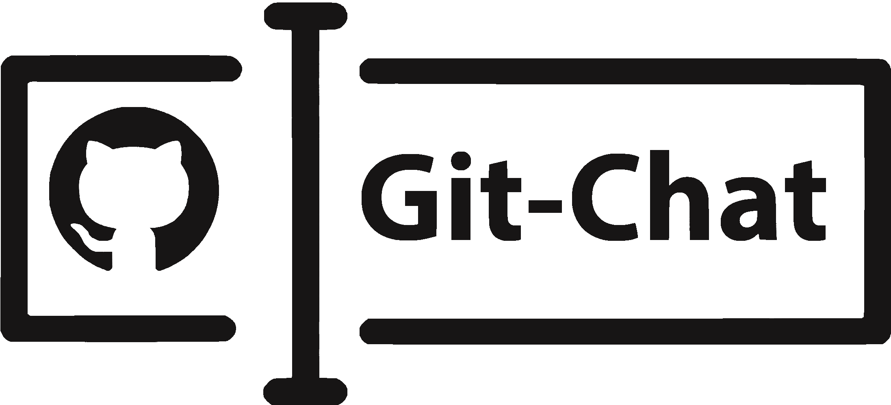

<p align="center"></p>

<p align="center">
  <a href="https://www.codacy.com?utm_source=github.com&amp;utm_medium=referral&amp;utm_content=MayorChano/NodeJS&amp;utm_campaign=Badge_Grade"></a>
  <a href="https://circleci.com/gh/dan-divy/git-chat"></a>
</p>

<p align="center"><code>git clone git@github.com:dan-divy/git-chat.git</code></p>
<p align="center">Git chat is a web-based utility to collaborate in real-time for your cool Github projects.</p>

## Motivation and Features

- Designed keeping real-time communication in mind.
- Authenticate from your Github account in just one-click.
- View your pull requests, issues and get reminders.
- Using the latest Tabler UI.
- Chat while you code with collaborators.
- Easiest shit in the world.

### Try it out

Find the working demo freshly deployed on DigitalOcean [here](https://git-chat.dancodes.online).

## Contributing

Setup

```bash
$ git clone git@github.com:dan-divy/git-chat.git
$ cd git-chat
$ npm run setup
$ npm i
```

Startup

```bash
$ npm start
```

## Maintainers

[](https://divy.work/) | [](https://dancodes.online) |
--|
[Divy Srivastava](https://divy.work/) | [DanCodes](https://dancodes.online)

## License

(The MIT License)

Copyright (c) 2019 Dan and Divy Organisation <dan@dancodes.online>

Permission is hereby granted, free of charge, to any person obtaining
a copy of this software and associated documentation files (the
'Software'), to deal in the Software without restriction, including
without limitation the rights to use, copy, modify, merge, publish,
distribute, sublicense, and/or sell copies of the Software, and to
permit persons to whom the Software is furnished to do so, subject to
the following conditions:

The above copyright notice and this permission notice shall be
included in all copies or substantial portions of the Software.

THE SOFTWARE IS PROVIDED 'AS IS', WITHOUT WARRANTY OF ANY KIND,
EXPRESS OR IMPLIED, INCLUDING BUT NOT LIMITED TO THE WARRANTIES OF
MERCHANTABILITY, FITNESS FOR A PARTICULAR PURPOSE AND NONINFRINGEMENT.
IN NO EVENT SHALL THE AUTHORS OR COPYRIGHT HOLDERS BE LIABLE FOR ANY
CLAIM, DAMAGES OR OTHER LIABILITY, WHETHER IN AN ACTION OF CONTRACT,
TORT OR OTHERWISE, ARISING FROM, OUT OF OR IN CONNECTION WITH THE
SOFTWARE OR THE USE OR OTHER DEALINGS IN THE SOFTWARE.
